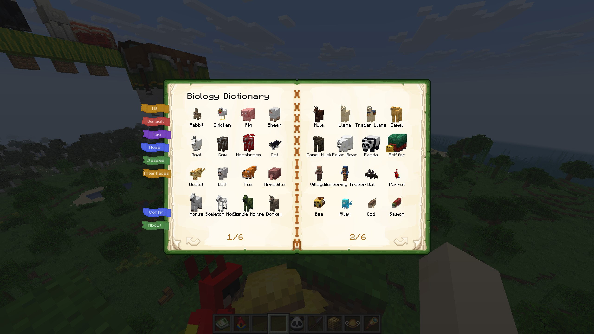
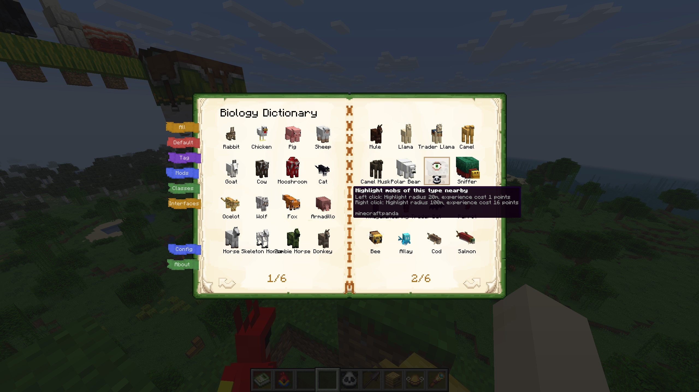
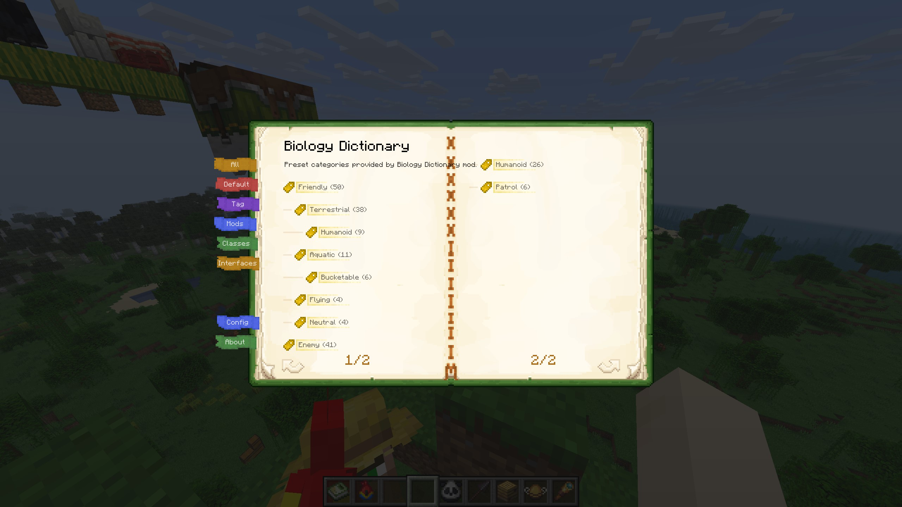
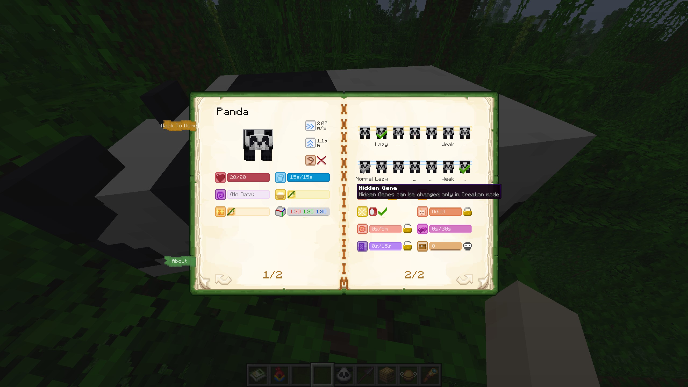
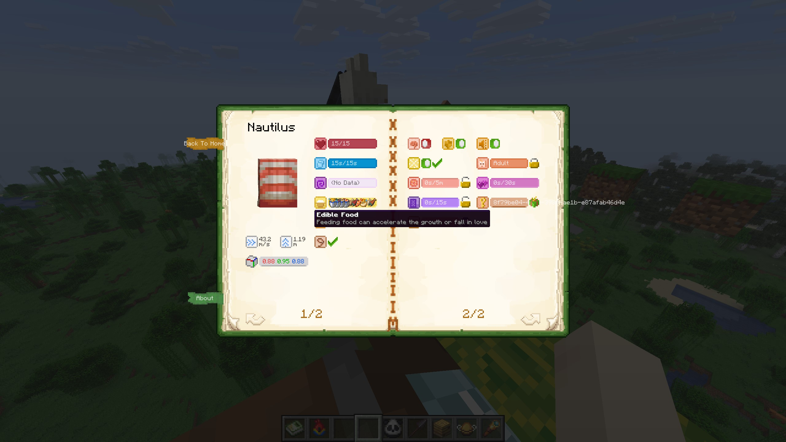
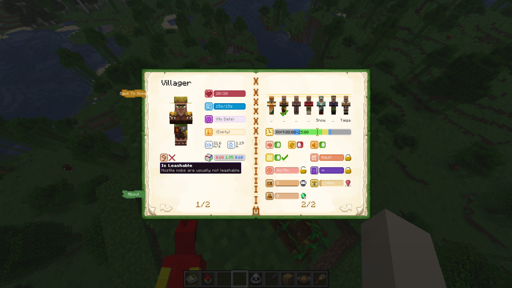
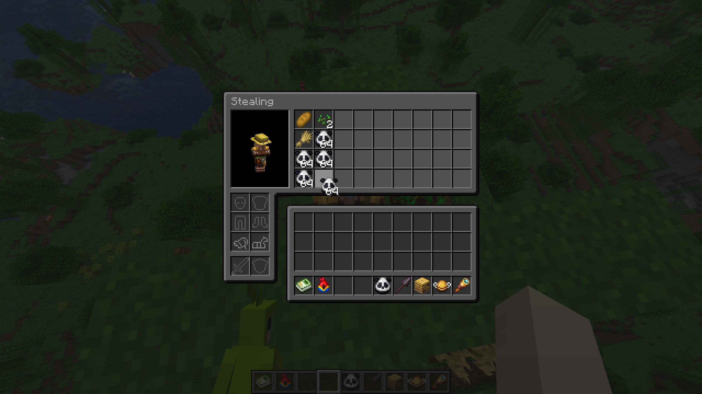
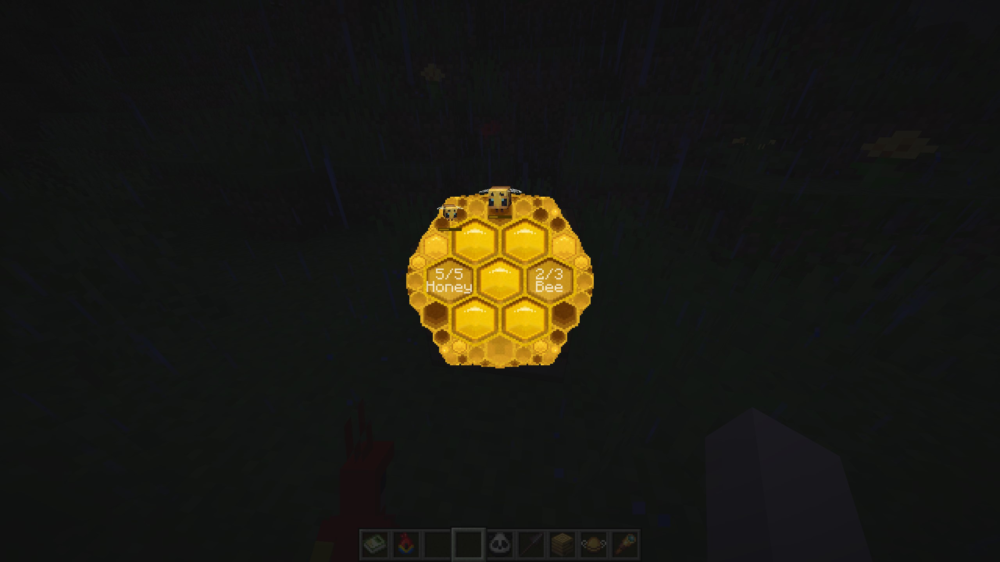
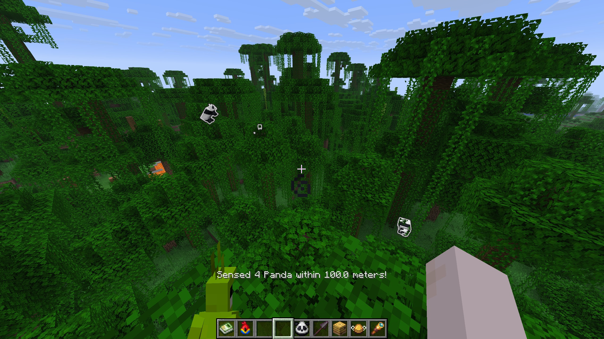

# Biology Dictionary

**English** | [**简体中文**](README.zh-CN.md)

---

## Introduction

**Biology Dictionary** is a **utility** Minecraft mod for viewing detailed information about mobs and modifying certain mob properties. This mod **does not add any new blocks/entities**, and can be safely uninstalled/reinstalled at any time, or when upgrading Minecraft versions.

> Strictly speaking, this mod adds a book item. However, the book is implemented using a writable book + NBT (now called "components"). After uninstalling the mod, it becomes a regular writable book. Reinstalling the mod will restore its functionality.

This mod was originally designed to enhance the experience for **technical survival players**, for example:

- Highlight entities within 100 meters to easily find rare mobs like parrots and pandas
- View horse jump/speed stats to quickly find high-performance horses
- View items that can attract/feed mobs for easier taming and breeding
- View villager work sites to help locate trading halls
- Block mobs from/force instant teleport through nether portals for easier mob transport
- Mute entities to avoid revealing decoration builds (e.g., chicken swings made with leads)
- Prevent baby animals from growing up to keep them cute (conveniently, `26.1 Snapshot 2` implemented better baby animals, making this feature even more useful!)
- Modify villager inventory items (presented as "stealing") for automatic farm designs
- Remove mob AI and make invincible for NPCs or decoration builds
- View honey and bee information in bee hives
- And much more

However, technical survival players sometimes don't care about mod aesthetics. I still hope this mod can be as immersive as possible and blend into vanilla game mechanics, so I added some lightweight settings and created a relatively immersive UI. Players need to pay a reasonable cost to modify entity properties.

> But my pixel art skills aren't great. Contributions to improve Biology Dictionary's UI are welcome!

|                                 |                                 |                                 |
|---------------------------------|---------------------------------|---------------------------------|
|  |  |  |
|  |  |  |
|  |  |  |

This mod currently only supports **Fabric API** and **Cloth Config API**. As development progressed, this mod seems to have drifted quite far from its original intention (enhancing technical survival experience), so some might ask why I didn't develop it for Forge, as many Forge mods add new mobs, and this mod seems useful for viewing attributes of those mobs.

- First, yes, this mod supports third-party mobs. If there's enough demand, I'll consider opening APIs for third-party mob entity widgets.
- Second, the mod's original intent was to enhance vanilla survival experience + keep up with latest Minecraft versions. When I started development, Forge was slow to update and didn't support optimizations like Sodium, so I didn't consider it. However, NeoForge has developed well recently, so I'm currently waiting to see how things progress.

> I'm becoming increasingly busy with work, but I'll still try my best to keep up with official Minecraft updates. However, I won't be adding too many complex features going forward.

## Detailed Features and Settings

This mod is a complete restructure of [**Bole**](https://github.com/xienaoban/minecraft-bole), as I wasn't satisfied with the previous implementation. **Biology Dictionary** is essentially a full rewrite of **Bole** without adding too many new features.

### Obtaining and Using Biology Dictionary

#### How to Obtain Biology Dictionary Item

- In Creative mode, find it at the end of the "Tools & Utilities" category
- In Survival mode, buy it from Wandering Traders. As game time progresses, the sale probability gradually decreases from 100% to a stable 20%
  > This design means you can find it everywhere when you start without emeralds, but once you're rich enough, it becomes rare hehe

#### How to Open Biology Dictionary Screen

- In Creative mode, simply use the hotkey (default `~`) to open the Biology Dictionary screen
- In Survival mode:
  - If you don't have Biology Dictionary in your inventory, you cannot open the screen
  - If you have the book:
    - Right-click the book to open
    - You can also use the hotkey to open

#### Screens for Different Targets

- Aiming at an entity opens that entity's detail page
- Aiming at a bee hive opens the bee hive page
- Aiming at other blocks or air opens the main menu

### All Supported Properties Display/Modification

The following lists all supported property display and modification features by entity class hierarchy:

- **Entity**
  - Entity model display (rotatable)
  - Air/oxygen value display
  - Bounding box size display
  - Invulnerable state toggle (Creative mode only)
  - Leashable status display
  - Portal cooldown lock (prevent/allow teleportation)
  - Mute toggle
  - **LivingEntity**
    - Health value display
    - Status effects display
    - Movement speed display (m/s)
    - Jump strength display (m)
    - Inventory viewing/stealing
    - **Mob**
      - AI toggle
      - Persistence display/modify (prevent natural despawning)
      - Tempt items display
      - **AgeableMob**
        - Growth progress display/lock as baby
        - Breeding cooldown display/prevent breeding
        - **Animal**
          - Breedable food items display
          - In-love status display
          - **Bee**
            - Hive location display/locate
            - Clear hive memory
          - **Dolphin**
            - Skin moistness display
          - **Goat**
            - Screaming goat status display
          - **Panda**
            - Main gene display/modify
            - Hidden gene display/modify
          - **Sheep**
            - Force eat grass (shearing)
          - **Villager**
            - Job site location display/locate
            - Daily restock count display/force restock
            - Schedule display
            - Villager type display/modify
          - **WanderingTrader**
            - Despawn delay display/retain
          - **Horse**
            - Color and markings display/modify
  - **OwnableEntity** (tamable mobs like wolves, cats, parrots, etc.)
    - Owner info display/gift pet
