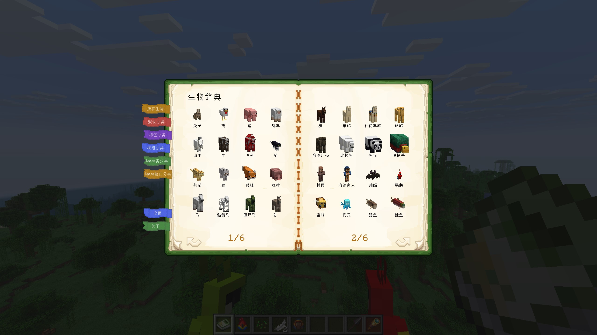
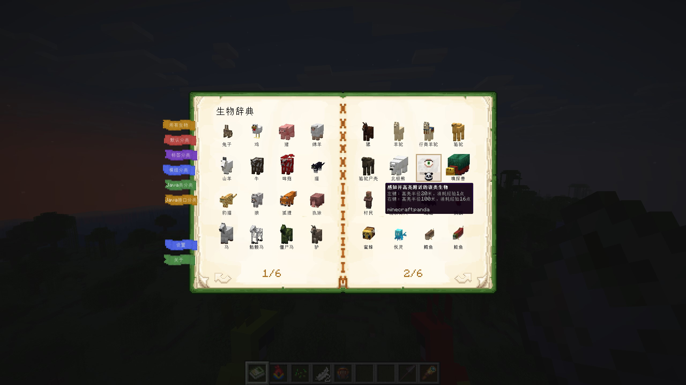
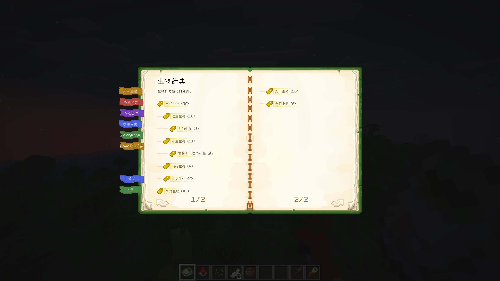
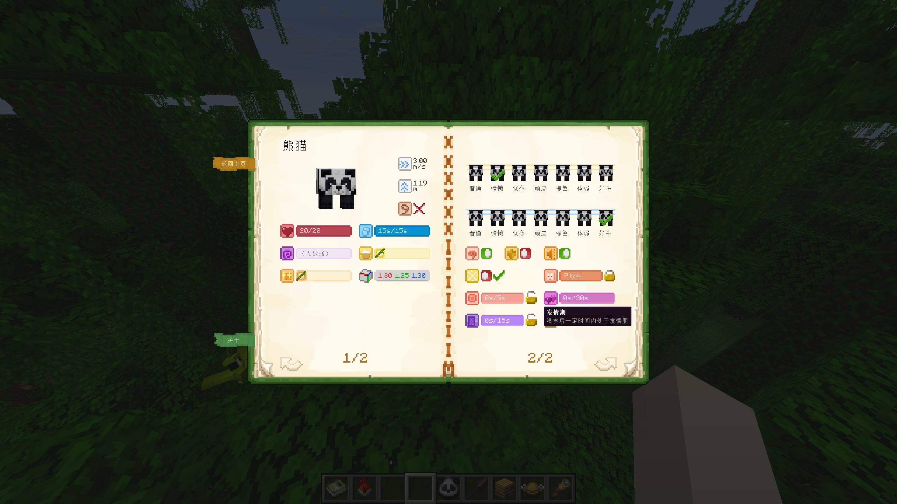
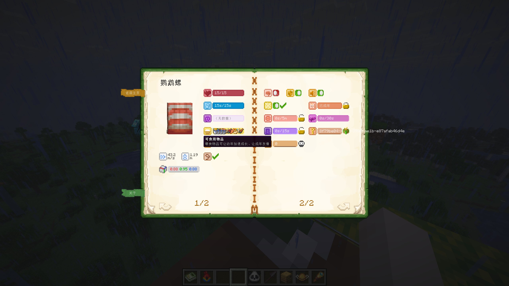
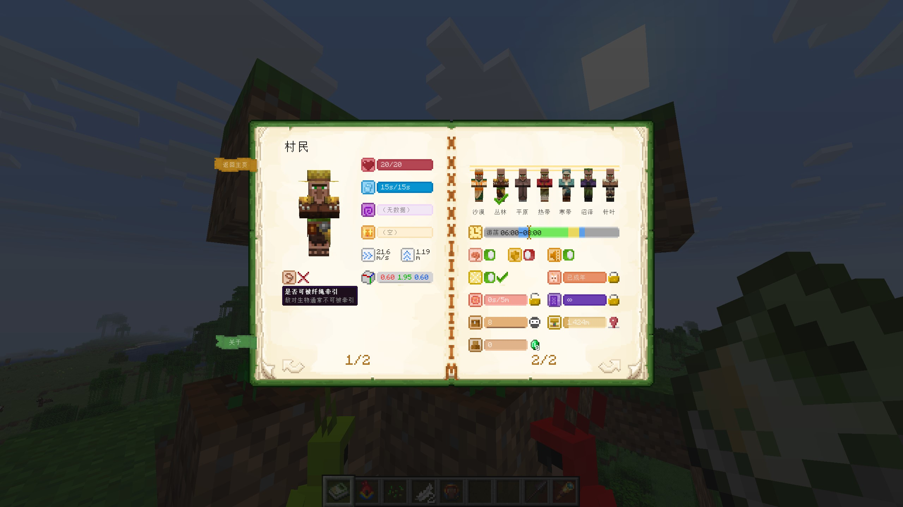
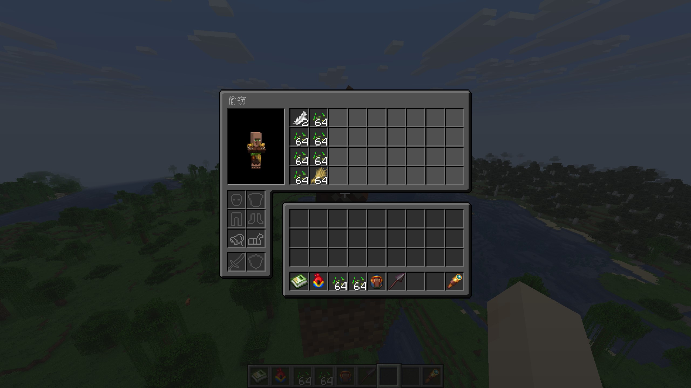
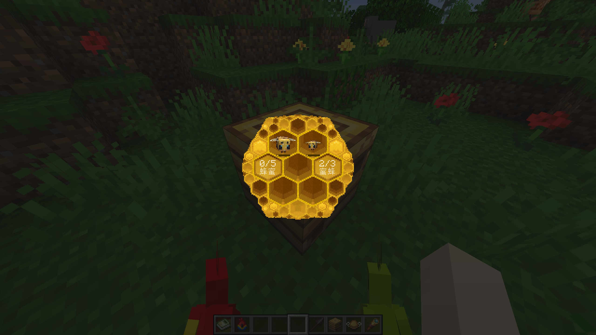
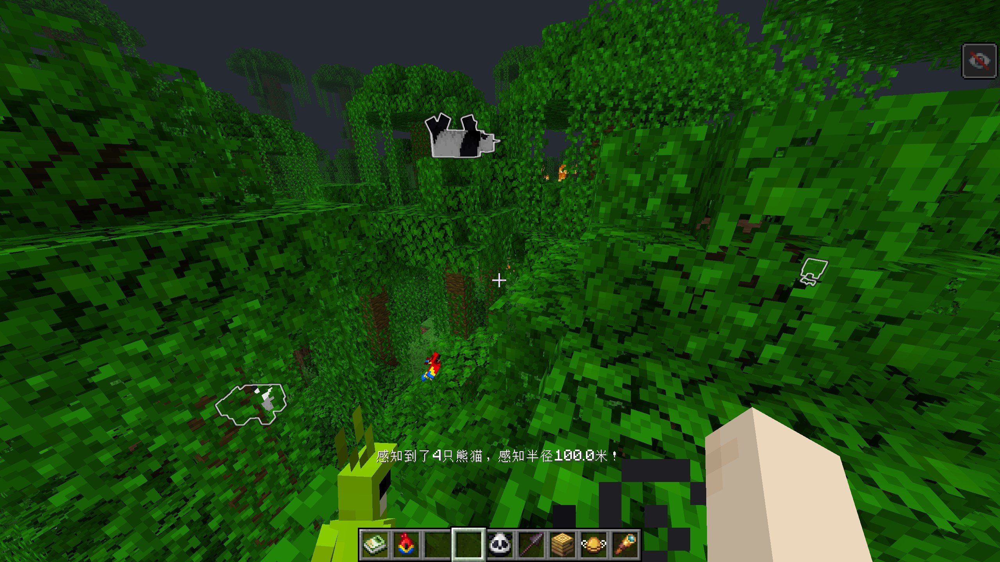

# 生物辞典

[**English**](README.md) | **简体中文**

  

  

---

## 简介

**生物辞典**是一个用于查看生物详细信息、并允许部分修改生物属性的**工具类**模组。本模组**未添加任何新方块/生物**，可以随时卸载/重装本模组、或升级我的世界版本。

> 严格来讲本模组添加了一本书，但该书是通过 writable book + NBT（现在叫“组件”了）实现的，卸载本模组后就是一本普通的书，重新安装回模组后即可使用。

本模组最初旨在补充**原版生存电路**玩家的游戏体验，例如：

- 高亮周围 100 米内的某类生物，方便寻找鹦鹉/熊猫等稀有生物
- 查看马匹的跳跃/奔跑能力，快速寻找高性能马匹
- 查看可吸引/投喂生物的物品，方便驯服、繁殖生物
- 查看村民的工作方块，方便定位搭建交易中心时遇到的麻烦
- 生物禁止/立即被地狱传送门传送，方便生物运输工程
- 给生物静音，避免一些造景（例如小鸡+拴绳做的秋千）露馅
- 禁止幼年生物长大，留住幼崽的可爱（正巧 `26.1 Snapshot 2` 实现了更好的幼年生物，该功能现在更有用了！）
- 修改村民背包物品（以“窃取”的功能形式表现），以便制作自动农场
- 剥除生物AI并设为无敌，做一些 NPC 或造景
- 查看蜂箱里的蜂蜜与蜜蜂信息
- 等等等等

但生电玩家有时过于没有人性、不在乎使用的模组的美观性，但我还是希望本模组是尽可能沉浸的、能够融入原版游戏规则的，因此我给它的功能做了一些轻量级的设定、做了一个相对沉浸的 UI，玩家对生物属性的修改需要付出一定合理的成本。

> 不过本人像素画不太专业，也欢迎大家一起来优化生物辞典的 UI。

|                                 |                                 |                                 |
|---------------------------------|---------------------------------|---------------------------------|
|  |  |  |
|  |  |  |
|  |  |  |

本模组当前支持 **Fabric** 和 **NeoForge** 两个加载器。

- Fabric 版本依赖 **Fabric API** 和 **Cloth Config API**。
- NeoForge 版本依赖 **Architectury API** 和 **Cloth Config API**。

## 详细功能与设定

本模组的前身是[**伯乐**](https://github.com/xienaoban/minecraft-bole)，但我对之前的底层实现不满意，**生物辞典**本质上是**伯乐**的一次全面重构，并没有添加太多新功能。

### 生物辞典获取与使用

#### 如何获取物品“生物辞典”

- 创造模式下，在“工具与实用物品”目录的最后可以找到
- 生存模式下，可以在流浪商人那买到，随着游戏时间推进，售卖概率从 100% 逐步下降，最终稳定在 20%
  > 主打一个刚开局没绿宝石时到处刷，玩到后面不缺绿宝石了就刷不到了嘿嘿

以及可以在设置里禁止流浪商人刷此交易，此时生存模式将无任何方式获得此书，需要整合包作者自行添加配方。

#### 如何打开界面

- 创造模式下，直接使用热键（默认 `~`）即可打开生物辞典界面
- 生存模式下，
  - 若物品栏不存在物品“生物辞典”，则无法打开界面
  - 若物品栏存在本书，则
    - 右键书本即可打开
    - 使用热键也可以打开

#### 瞄准不同目标打开的界面

- 瞄准生物时，打开该生物的详情信息页
- 瞄准蜂箱时，打开蜂箱页面
- 瞄准其他方块或空气时，打开主界面
- 瞄准正上方时，无视是否指向生物，强制打开主界面
- 瞄准正下方时，打开玩家自己的详情信息界面

### 支持的所有属性展示或修改

以下按实体类的继承关系列出了所有支持的属性展示和修改功能：

- **Entity**（实体基类）
  - 显示实体模型（可旋转查看）
  - 空气值/氧气值显示
  - 碰撞箱尺寸显示
  - 无敌状态开关（仅创造模式）
  - 是否可拴绳显示
  - 传送门冷却锁定（禁止/允许传送）
  - 静音开关
  - **LivingEntity**（生物实体）
    - 生命值显示
    - 状态效果显示
    - 移动速度显示（m/s）
    - 跳跃强度显示（m）
    - 背包物品查看/窃取
    - **Mob**（怪物/生物）
      - AI 开关
      - 持久性显示/修改（防止自然消失）
      - 吸引物品显示
      - **AgeableMob**（可成长的生物）
        - 生长进度显示/锁定幼年
        - 繁殖冷却显示/禁止繁殖
        - **Animal**（动物）
          - 可喂食物品显示
          - 繁殖状态显示
          - **Bee**（蜜蜂）
            - 蜂巢位置显示/定位
            - 清除蜂巢记忆
          - **Dolphin**（海豚）
            - 皮肤湿润度显示
          - **Goat**（山羊）
            - 是否为尖叫山羊显示
          - **Panda**（熊猫）
            - 主基因显示/修改
            - 隐藏基因显示/修改
          - **Sheep**（绵羊）
            - 强制吃草（剪毛）
          - **Villager**（村民）
            - 工作站点位置显示/定位
            - 每日补货次数显示/强制补货
            - 日程表显示
            - 村民类型显示/修改
          - **WanderingTrader**（流浪商人）
            - 消失延迟显示/保留
          - **Horse**（马及其变种）
            - 颜色和斑纹显示/修改
  - **OwnableEntity**（可驯服生物，如狼、猫、鹦鹉等）
    - 主人信息显示/赠送宠物

