

**[English](README.md)** | 简体中文

# 生物辞典

**图鉴收集、高亮搜索、查看属性、修改行为 —— 你的原版+模组生物百科全书**

---

## 遇到过这些困扰？

| 场景                          | 生物辞典能做什么               |
|-----------------------------|------------------------|
| 想探索发现所有生物                   | 打开图鉴，查看所有生物的发现进度       |
| 想知道生物的生成群系、掉落物、食物、速度、碰撞箱... | 一页纵览所有基础属性             |
| 想知道马、熊猫、村民等有多少种类            | 查看生物的所有种类（并可在创造模式修改）   |
| 幼年动物太可爱了不想让它长大              | 一键锁定生长阶段，永远保持宝宝模样      |
| 烤鸡机里的几十只鸡太吵了                | 一键静音，且子代遗传静音属性         |
| 村民交易厅建好了，但找不到村民工作站          | 一键定位村民工作站点，再也不用盲目挖工作方块 |
| 村民总是制作面包，影响自动农村工作           | 偷窃村民背包并塞满垃圾，阻止捡起小麦     |
| 蜜蜂放飞后不知道去了哪个蜂巢              | 查看蜂巢蜂蜜存量和蜜蜂数量，追踪蜜蜂的家   |
| 跨维度运输生物太痛苦                  | 锁定或强制生物通过地狱门，轻松搬运      |
| 想把生物放进装饰建筑里当 NPC            | 一键关闭 AI 并设为无敌，在生存中造景   |

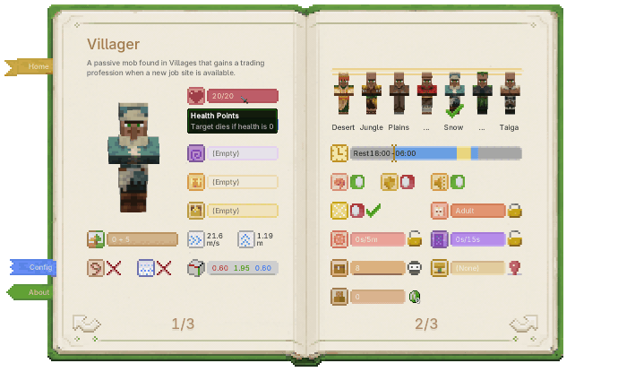

*所有问题，一个界面全部解决！*

---

## 玩法速览

- **不新增任何方块或实体，原版友好，随时可安全卸载（本模组的物品书由 NBT 实现）。**
- **完美支持原版生物+模组生物。**

### 翻开生物辞典首页

|                     生物辞典                     |                       探索进度                        |
|:--------------------------------------------:|:-------------------------------------------------:|
| 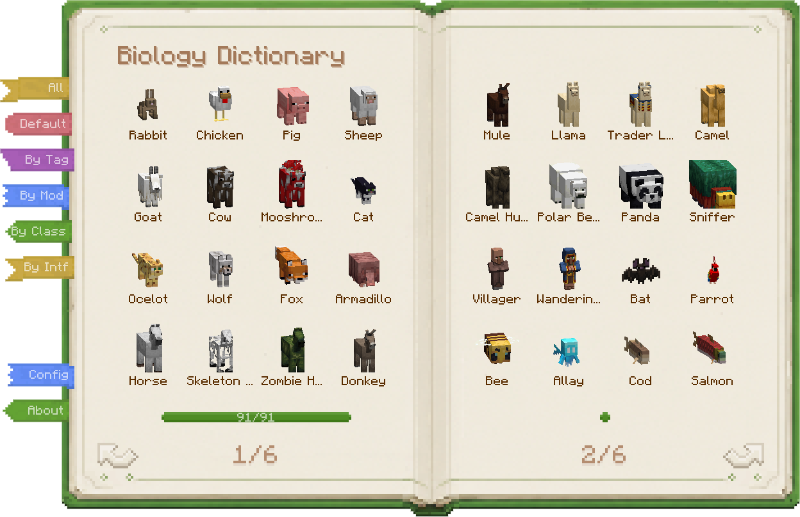 | 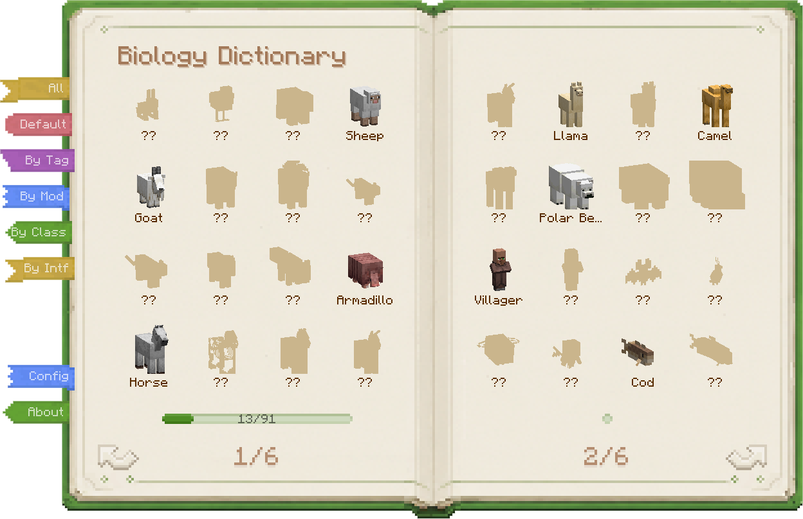 |
|               原版生物、模组生物，一网打尽。                |                 收集生物图鉴，更多生物等你发现。                  |

- **完整生物目录** — 原版生物、模组生物，无需配置，一网打尽。
- **探索进度** — 显示生物图鉴收集进度，更多生物等你「发现」。
- **多种「发现」策略** — 直白的「全部解锁」策略、忠于原版的「原版击杀」策略、或可高度自定义的「生物辞典」策略。
- **多种「发现」方式** — 打开详情页、望远镜远眺、交互、击杀……都可以配置是否视为「发现」。
- **详细的「发现」记录** — 记录发现来源、发现时间、地点……让图鉴不只是打勾（仅限「生物辞典」策略）。
- **模块交互可配置** — 默认禁止查看未发现生物的信息，也可以让「发现」系统只作为独立收集系统。
- **高亮附近生物** — 可高亮附近同类生物，高亮距离不同，技能消耗不同。

|                    望远镜发现                    |                     生物高亮                     |
|:-------------------------------------------:|:--------------------------------------------:|
| 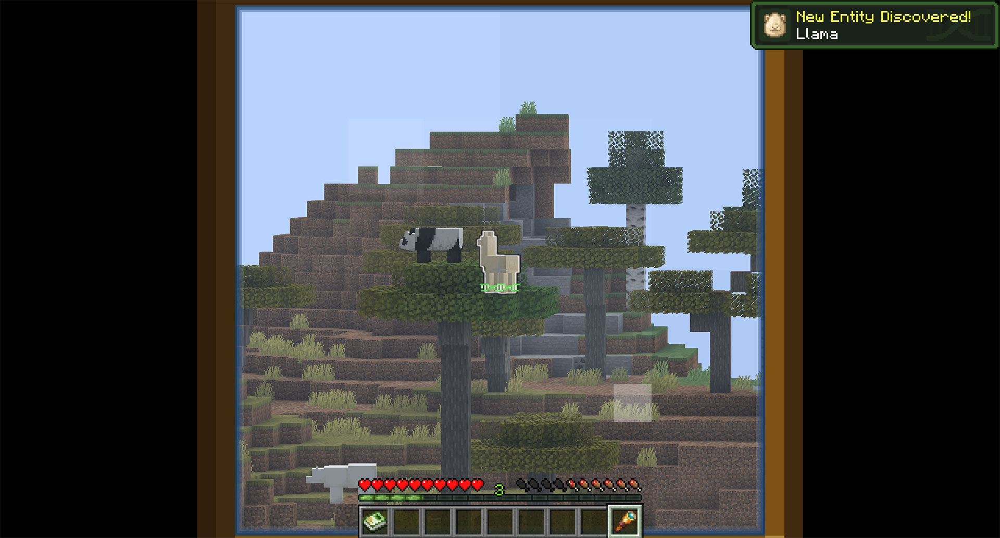 | 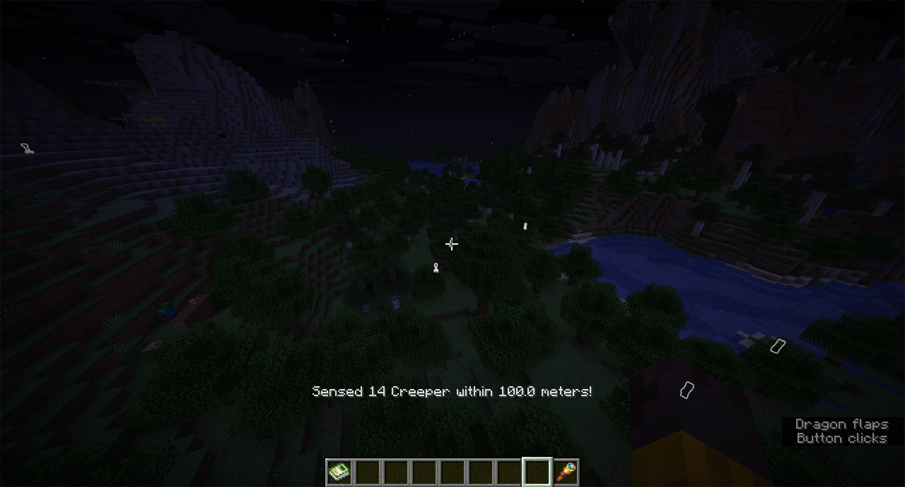 |
|              用望远镜远远看一眼，也算正式发现。              |              高亮附近生物，寻找稀有目标更快捷。               |

### 翻到生物详情页 & 生物标签页

|                     生物详情                     |                     生物标签                     |
|:--------------------------------------------:|:--------------------------------------------:|
| 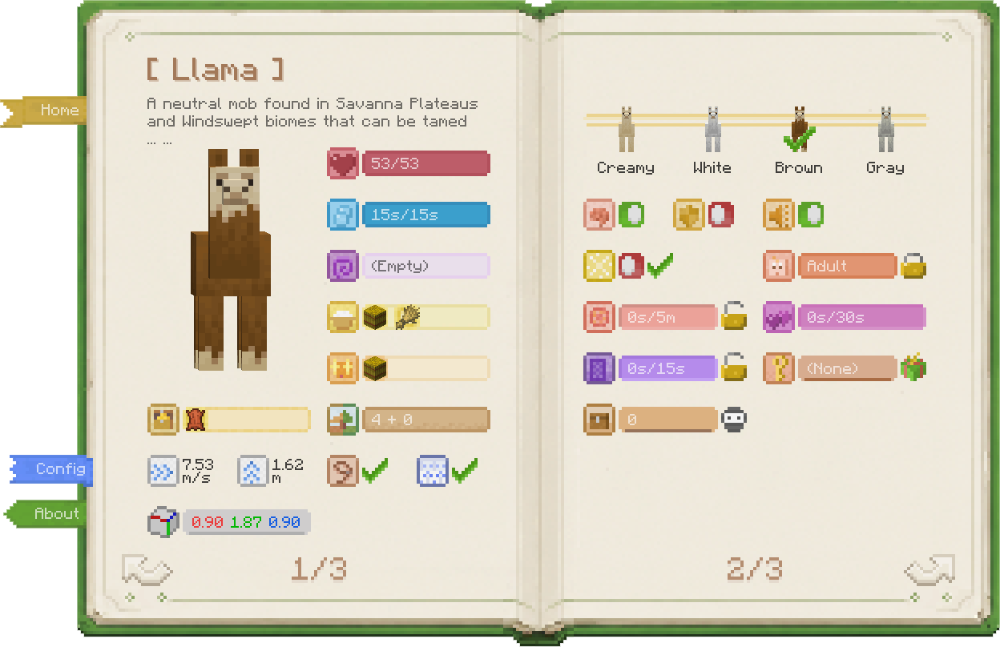 | 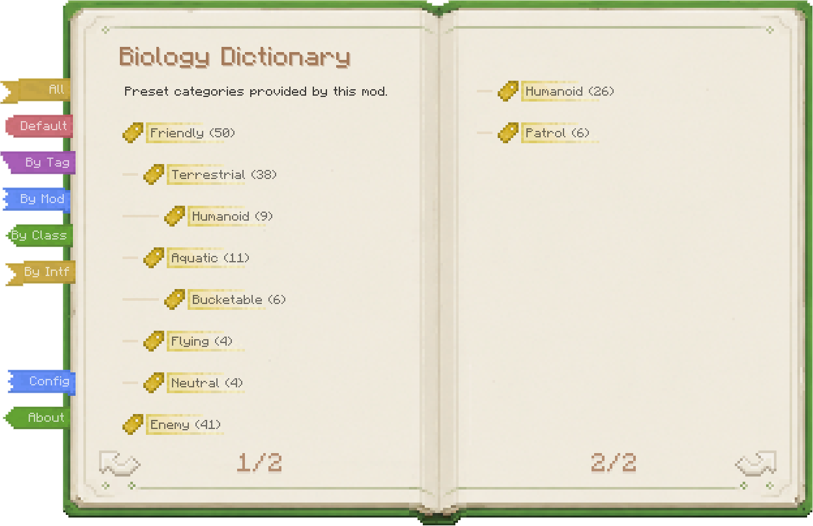 |
|            打开生物详情，查看属性、施展技能、修改行为。            |               多维度分类生物，方便快速查找。                |

- **概览页 / 详情页** — 概览页展示该生物类型的默认/参考属性；详情页显示目标生物的当下真实状态。
- **基础属性** — 血量、体内氧气、状态效果、移动速度、跳跃力度、碰撞箱、是否计入刷怪上限。
- **生态信息** — 栖息地、战利品表、可食用物品、可引诱物品、是否可拴绳。
- **外观与变种** — 常规变种、马花纹、熊猫显性/隐性基因、村民类型等。
- **行为状态** — AI、无敌、静音、持久化、传送门冷却、生长阶段、繁殖冷却、恋爱状态。
- **特殊生物信息** — 村民日程与补货、村民工作站、蜜蜂蜂巢、海豚潮湿度、尖叫山羊、宠物主人、流浪商人离开倒计时。
- **生物技能** — 锁定生长、阻止繁殖、控制传送门、关闭 AI、强制持久化、静音、强制补货、挽留流浪商人、赠送宠物、获取刷怪蛋等。
- **技能消耗** — 各个技能需要一定消耗经验、物品或权限，可在配置文件中调整。

标签页支持多种分类：作者预设分类、按 MC Tag 分类、按模组分类、按 Java 类/接口分类。

### 特殊界面

- **物品栏访问** — 查看村民等生物的物品栏，取出或填充物品；生存模式下视为窃取，需要躲开目标视线。
- **蜂巢信息** — 对着蜂巢/蜂箱打开专属界面，查看蜂蜜存量、蜜蜂数量与蜂巢内蜜蜂状态。

|                   物品栏访问                   |                   蜂巢信息                   |
|:-----------------------------------------:|:----------------------------------------:|
| 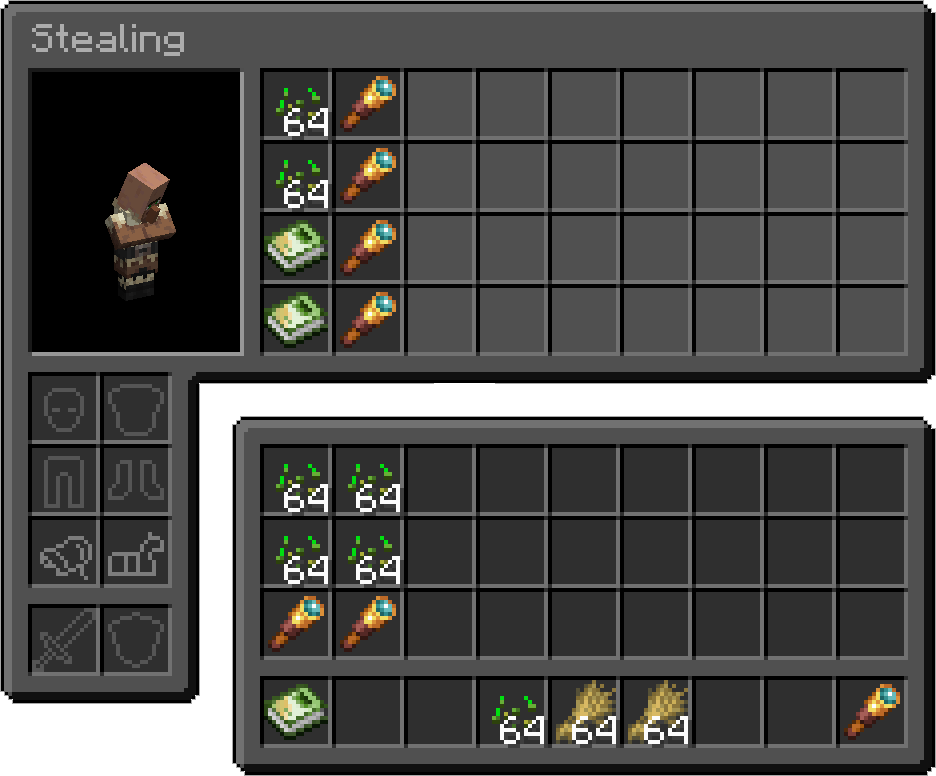 | 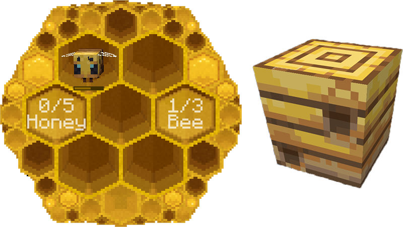 |
|           盗取或填充生物物品栏，让村民捡不起小麦。            |           对着蜂巢使用生物辞典，查看蜜蜂和蜂蜜。            |

## 打开方式

本模组的承载形式是一个个的界面。生物辞典界面打开方法：
1. 手持《生物辞典》书本物品时，右键使用
2. 生存模式且物品栏存在《生物辞典》时、或配置了无需书本时、或创造模式时，按快捷键（默认`` ` ``）

玩家瞄准不同目标时会打开不同界面。

| 瞄准目标    | 打开页面    |
|---------|---------|
| 方块 / 空气 | 主菜单     |
| 生物      | 该生物的详情页 |
| 蜂巢      | 蜂巢信息页   |
| 正上方     | 主菜单（强制） |
| 正下方     | 玩家自身详情页 |

---

## 获取方式

《生物辞典》书本物品的获取方式。注：
> 1. 创造模式、或配置了生存模式可使用快捷键时，本书没有存在的必要
> 2. 本书本质为 `minecraft:writable_book` + NBT，未创建新物品，原版友好

|                    流浪商人出售                    |                     创造模式物品栏                     |
|:--------------------------------------------:|:-----------------------------------------------:|
| 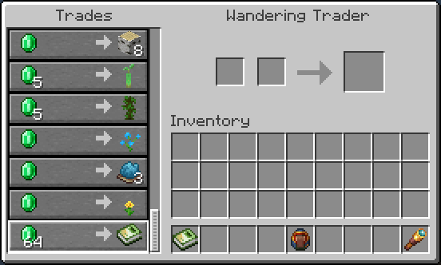 | 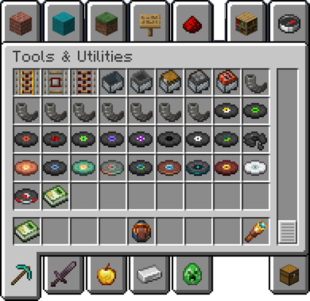 |
|            生存模式下，可向流浪商人购买《生物辞典》。             |            创造模式下，可在工具与实用物品分类末尾找到本书。             |

### 生存模式

向**流浪商人**购买即可。游戏初期出售概率 100%，随游戏时间推移逐渐降至稳定的 20%。不占用流浪商人原版销售栏位。

> 主打前期买不起、后期买不到（发出了反派的笑声）~
> 
> 其实还好啦，要玩到**现实时间**的 2 天后（也就是游戏时间的 144 天后），概率才降到 20%，相信你那时候早就绿宝石自由了。

也可在配置中关闭流浪商人出售，由整合包作者自行添加合成配方。

### 创造模式

在「工具与实用物品」分类末尾找到《生物辞典》书本物品。

## 模组与数据包支持

- **自定义生物描述** — 通过资源包添加或覆盖生物描述（[文档](docs/custom-data.zh-CN.md)）。
- **自定义生成描述** — 通过数据包手动调整模组生物的生成群系、结构描述（[文档](docs/custom-data.zh-CN.md)）。

---

## 依赖

| 加载器 | 依赖模组 |
|--------|---------|
| Fabric | Fabric API、Cloth Config |
| NeoForge / Forge | Architectury API (<=1.21.11), Cloth Config |

---

## 其他

- **原版友好** — 不新增方块或实体，卸载后辞典变为普通可书写书，重装即恢复。
- **模组友好** — 几乎完美兼容所有模组的生物，并提供模组扩展能力。
- **游戏平衡** — 所有修改操作都需要消耗合理资源，保持游戏平衡。
- 本模组是 [Bole](https://github.com/xienaoban/minecraft-bole) 的完全重构版本。

---

